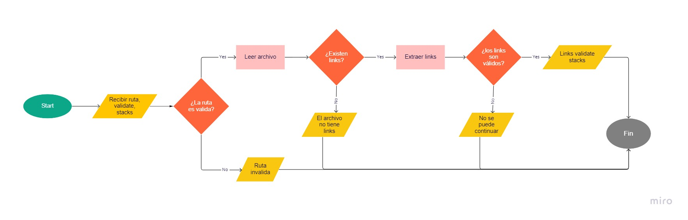

# memb-mdlinks

## Índice

- [1. Sobre membMDlinks](#1-Sobre-memb-mdlinks)
- [2. Instación](#2-instalacion)

---

## 1.Sobre membMDlink

Esta es una librería que permite extraer, leer y verificar la validez de los links presentes dentro de archivos con formato .md (markdown).

### Diarama de Flujo

## 2.Instalación

Para poder instalar esta librería debes tener instalado Node.js de forma previa. Luego debes ejecutar el siguiente comando en la terminal:
