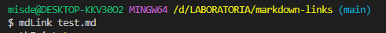
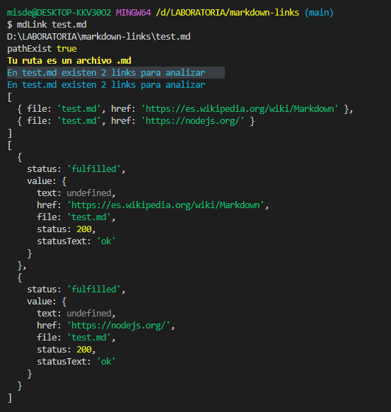
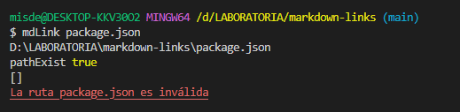
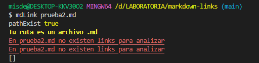
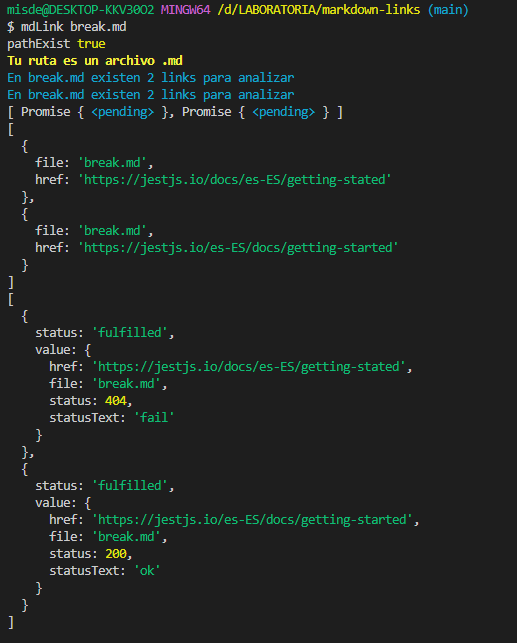

# memb-mdlinks

## Índice

- [1. Descripción](#1-Descripción)
- [2. Diagrama de Flujo](#2-Diagrama-de-Flujo)
- [3. Instalación](#3-Instalación)
- [4. Ejemplos](#4-Ejemplos)

---

## 1.Descripción

Esta es una librería que permite extraer, leer y verificar la validez de los links presentes dentro de archivos con formato .md (markdown).

---

## 2. Diarama de Flujo

---

## 3.Instalación

Para poder instalar esta librería debes tener instalado Node.js de forma previa. Luego debes ejecutar el siguiente comando en la terminal:

---

## 4. Ejemplos

- Se coloca `mdLink` y el nombre del archivo a analizar

- Al ser escaneado el archivo, muestra si la ruta existe, si es un archivo `.md` y cuantos links tiene para analizar

- Al ingresar una ruta inválida

- Si no existen links para analizar

- Si existe un link roto

